# Sequence Diagram — PaddleText Worker (TextRawHandler)

> Engine: `paddle_text` | Method: `ocr_paddle_text` | GPU: Yes

## Tổng quan

Worker sử dụng PaddleOCR để trích xuất text từ ảnh hoặc PDF (multi-page). Hỗ trợ cả PaddleOCR v2.x (ocr API) và v3.x (predict API). Luồng xử lý đi qua 3 giai đoạn: preprocessing → inference → postprocessing.

## Sequence Diagram

```mermaid
%%{init: {'theme': 'default'}}%%
sequenceDiagram
    autonumber
    participant Main as main.py
    participant Worker as OCRWorker
    participant Queue as QueueClient<br/>(NATS JetStream)
    participant State as WorkerState
    participant Orch as OrchestratorClient<br/>(Backend API)
    participant FP as FileProxyClient<br/>(Backend API)
    participant Proc as OCRProcessor
    participant Handler as TextRawHandler
    participant Pre as preprocessing.py
    participant Paddle as PaddleOCR Engine
    participant Post as postprocessing.py

    Note over Main,Post: ===== PHASE 1: WORKER STARTUP =====

    Main->>Worker: OCRWorker(shutdown_handler)
    Worker->>Proc: OCRProcessor()
    Note right of Proc: OCR_ENGINE="paddle" (default)
    Proc->>Handler: TextRawHandler(use_gpu, lang)

    alt PaddleOCR v3.x
        Handler->>Paddle: PaddleOCR(lang="en")
        Note right of Paddle: v3: không có use_gpu/show_log params
    else PaddleOCR v2.x
        Handler->>Paddle: PaddleOCR(use_gpu=True, lang="en", show_log=False)
    end
    Paddle-->>Handler: ocr engine ready

    Worker->>Orch: POST /register<br/>{service_type, instance_id, allowed_methods: ["ocr_paddle_text"], engine_info}
    Orch-->>Worker: {type_status: "APPROVED", access_key: "xxx"}
    Worker->>Queue: connect() → NATS JetStream<br/>stream="OCR_JOBS", subject="ocr.ocr_paddle_text.tier0"
    Worker->>Worker: heartbeat.start() (mỗi 30s)

    Note over Main,Post: ===== PHASE 2: JOB POLLING LOOP =====

    loop Mỗi vòng lặp (while not shutdown)
        Worker->>Worker: Check: is_approved? is_draining?
        Worker->>Queue: pull_job(timeout=5s)
        Queue-->>Worker: job = None (nếu không có việc)
        Note right of Worker: Tiếp tục polling...

        Queue-->>Worker: job = {job_id, file_id, method: "ocr_paddle_text", output_format: "json"}
    end

    Note over Main,Post: ===== PHASE 3: XỬ LÝ JOB =====

    Worker->>State: start_job(job_id)
    State-->>Worker: status = "processing"

    Worker->>Orch: PATCH /jobs/{job_id}/status<br/>{status: "PROCESSING"}
    alt 404 — Job not found
        Orch-->>Worker: 404
        Worker->>Queue: term(msg_id)
        Note right of Queue: Stale message → loại bỏ
    else 200 OK
        Orch-->>Worker: 200 OK
    end

    Note over Worker,FP: 3a. Download file từ MinIO qua Backend

    Worker->>FP: POST /file-proxy/download<br/>{job_id, file_id}
    FP-->>Worker: file_bytes (image hoặc PDF)

    Note over Worker,Post: 3b. OCR Processing

    Worker->>Proc: process(file_bytes, "json", "ocr_paddle_text")
    Proc->>Handler: process(file_bytes, "json")

    Note over Handler,Post: --- Preprocessing (multi-page support) ---
    Handler->>Pre: load_images(file_bytes)
    alt File là PDF
        Pre->>Pre: pypdfium2: render mỗi trang @ 200 DPI
        Pre->>Pre: Giới hạn MAX_PDF_PAGES (env, default=5)
        Pre->>Pre: Với mỗi trang: convert RGB → np.array
        Pre-->>Handler: pages = [(np_array_page1, size1), (np_array_page2, size2), ...]
    else File là ảnh
        Pre->>Pre: PIL.Image.open() → RGB → np.array
        Pre-->>Handler: pages = [(np_array, size)]
    end

    Note over Handler,Post: --- Inference: Xử lý từng trang ---

    loop Với mỗi (img_array, size) trong pages
        alt PaddleOCR v3.x
            Handler->>Paddle: self.ocr.predict(img_array)
            Paddle-->>Handler: results = [{rec_texts, rec_scores, rec_polys}]
            Handler->>Handler: _extract_v3(results) → (full_text, text_lines, boxes_data)
        else PaddleOCR v2.x
            Handler->>Paddle: self.ocr.ocr(img_array, cls=True)
            Note right of Paddle: PaddleOCR thực hiện:<br/>1. Text Detection (DB)<br/>2. Direction Classification<br/>3. Text Recognition (CRNN)
            Paddle-->>Handler: ocr_result = [[[box, (text, confidence)], ...]]
            Handler->>Post: extract_results(ocr_result)
            Post->>Post: Duyệt qua từng line trong result[0]
            Post->>Post: Thu thập: text_lines[], boxes_data[]
            Post-->>Handler: (full_text, text_lines, boxes_data)
        end
        Handler->>Handler: all_text_lines.extend(text_lines)
        Handler->>Handler: all_boxes_data.extend(boxes_data)
    end

    Note over Handler,Post: --- Postprocessing: Format output ---

    Handler->>Handler: full_text = "\n".join(all_text_lines)
    Handler->>Post: format_output(full_text, all_text_lines, all_boxes_data, "json")
    alt output_format == "json"
        Post->>Post: JSON: {"text", "lines" (count), "details": [{text, confidence, box}]}
        Post-->>Handler: json_bytes (UTF-8)
    else output_format == "txt"
        Post->>Post: Plain text (full_text.encode("utf-8"))
        Post-->>Handler: text_bytes
    end

    Handler-->>Proc: result_bytes
    Proc-->>Worker: result_bytes

    Note over Worker,FP: 3c. Upload kết quả lên MinIO qua Backend

    Worker->>Worker: Determine content_type:<br/>json→"application/json", txt→"text/plain"
    Worker->>FP: POST /file-proxy/upload<br/>{job_id, file_id, content: base64(result), content_type}
    FP-->>Worker: {result_key: "results/..."}

    Note over Worker,Orch: 3d. Cập nhật trạng thái hoàn thành

    Worker->>Orch: PATCH /jobs/{job_id}/status<br/>{status: "COMPLETED", engine_version: "paddleocr X.Y.Z"}
    Orch-->>Worker: 200 OK

    Worker->>Queue: ack(msg_id)
    Queue-->>Worker: ACK confirmed

    Note over Worker,State: 3e. Cleanup state (finally block — luôn chạy)
    Worker->>State: end_job()
    State-->>Worker: current_job_id=None, status="idle", files_completed++

    Note over Main,Post: ===== ERROR HANDLING =====

    rect
        Note over Worker,Post: Nếu xảy ra lỗi trong quá trình xử lý:

        alt RetriableError (download/upload timeout, connection error)
            Worker->>Orch: PATCH /jobs/{job_id}/status<br/>{status: "FAILED", error, retriable: true}
            Worker->>Queue: nak(msg_id, delay=5s)
            Note right of Queue: Message sẽ được retry sau 5s
        else PermanentError (ảnh không hợp lệ, format lỗi)
            Worker->>Orch: PATCH /jobs/{job_id}/status<br/>{status: "FAILED", error, retriable: false}
            Worker->>Queue: term(msg_id)
            Note right of Queue: Message bị loại bỏ vĩnh viễn
        else Unexpected Exception (bất kỳ lỗi khác)
            Note right of Worker: Xử lý như retriable (conservative)
            Worker->>Orch: PATCH /jobs/{job_id}/status<br/>{status: "FAILED", error, retriable: true}
            Worker->>Queue: nak(msg_id, delay=5s)
        else 404 khi report FAILED
            Worker->>Queue: term(msg_id)
            Note right of Queue: Backend không biết job → loại bỏ
        end

        Worker->>State: record_error()
        State-->>Worker: error_count++
    end

    Note over Main,Post: ===== HEARTBEAT (song song, mỗi 30s) =====

    loop Mỗi 30 giây
        Worker->>Orch: POST /heartbeat<br/>{instance_id, status, current_job_id, files_completed, error_count}
        Orch-->>Worker: {action: "continue"}
        alt action == "continue"
            Worker->>Worker: Reset _re_register_attempts = 0
        else action == "approved"
            Worker->>Worker: Set access_key, is_approved = true
        else action == "re_register"
            Worker->>Worker: _retry_registration() với exponential backoff
            Note right of Worker: Delay: 0s, 5s, 10s, 20s, 40s... max 60s
        else action == "drain"
            Worker->>Worker: is_draining = True → hoàn thành job hiện tại rồi dừng
        else action == "shutdown"
            Worker->>Orch: POST /deregister {instance_id}
            Worker->>Worker: shutdown
        end
    end
```



## Chi tiết Data Flow

### Input
| Field | Type | Mô tả |
|-------|------|--------|
| `file_bytes` | `bytes` | Dữ liệu ảnh (PNG, JPG, TIFF) hoặc PDF (multi-page) |
| `output_format` | `str` | `"json"` hoặc `"txt"` |

### Output (JSON format)
```json
{
  "text": "Toàn bộ text trích xuất",
  "lines": 42,
  "details": [
    {
      "text": "Dòng text",
      "confidence": 0.9523,
      "box": [[x1,y1], [x2,y2], [x3,y3], [x4,y4]]
    }
  ]
}
```

### Output (TXT format)
```
Dòng 1
Dòng 2
...
```

## Error Classification

| Exception | Loại | Hành động |
|-----------|------|-----------|
| `ConnectionError`, `TimeoutError` | Retriable | NAK + retry sau 5s |
| `DownloadError`, `UploadError` | Retriable | NAK + retry sau 5s |
| `InvalidImageError`, `ValueError` | Permanent | TERM + không retry |
| `UnidentifiedImageError` | Permanent | TERM + không retry |
| Unexpected Exception | Retriable | NAK + retry (conservative) |
| 404 Job not found | — | TERM (stale message) |
