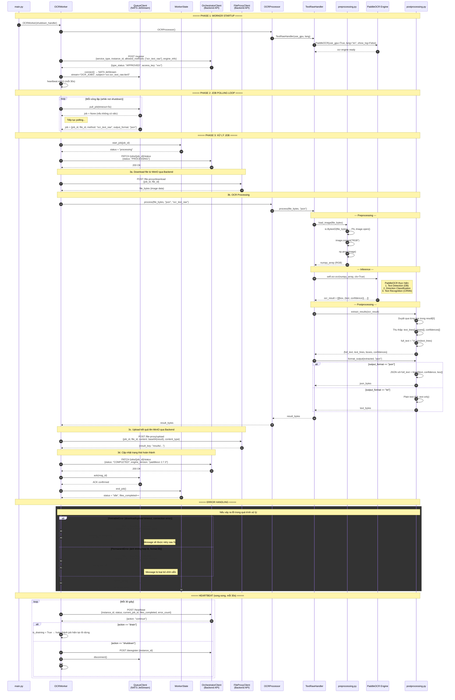

# Sequence Diagram — PaddleText Worker (TextRawHandler)

> Engine: `paddle_text` | Method: `ocr_text_raw` | GPU: Yes

## Tổng quan

Worker sử dụng PaddleOCR để trích xuất text từ ảnh đơn. Luồng xử lý đi qua 3 giai đoạn: preprocessing → inference → postprocessing.

## Sequence Diagram



## Chi tiết Data Flow

### Input
| Field | Type | Mô tả |
|-------|------|--------|
| `file_bytes` | `bytes` | Dữ liệu ảnh (PNG, JPG, TIFF...) |
| `output_format` | `str` | `"json"` hoặc `"txt"` |

### Output (JSON format)
```json
{
  "full_text": "Toàn bộ text trích xuất",
  "lines": [
    {
      "text": "Dòng text",
      "confidence": 0.95,
      "box": [[x1,y1], [x2,y2], [x3,y3], [x4,y4]]
    }
  ]
}
```

### Output (TXT format)
```
Dòng 1
Dòng 2
...
```

## Error Classification

| Exception | Loại | Hành động |
|-----------|------|-----------|
| `ConnectionError`, `TimeoutError` | Retriable | NAK + retry sau 5s |
| `DownloadError`, `UploadError` | Retriable | NAK + retry sau 5s |
| `InvalidImageError`, `ValueError` | Permanent | TERM + không retry |
| `UnidentifiedImageError` | Permanent | TERM + không retry |
