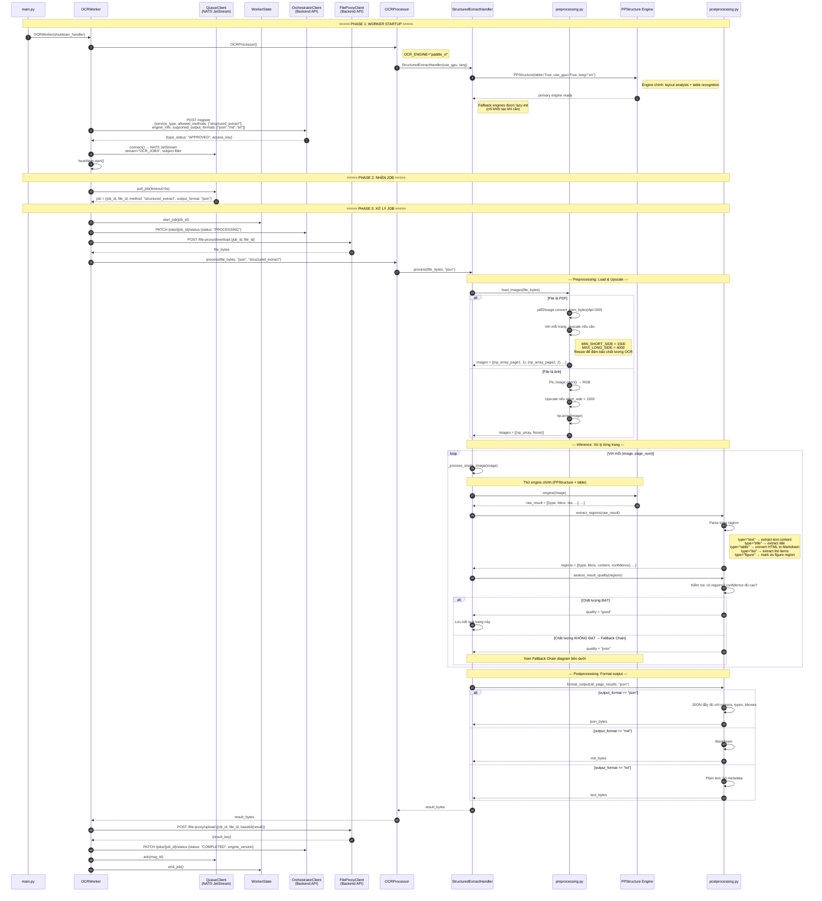
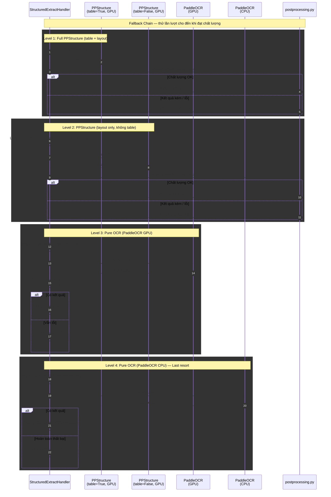
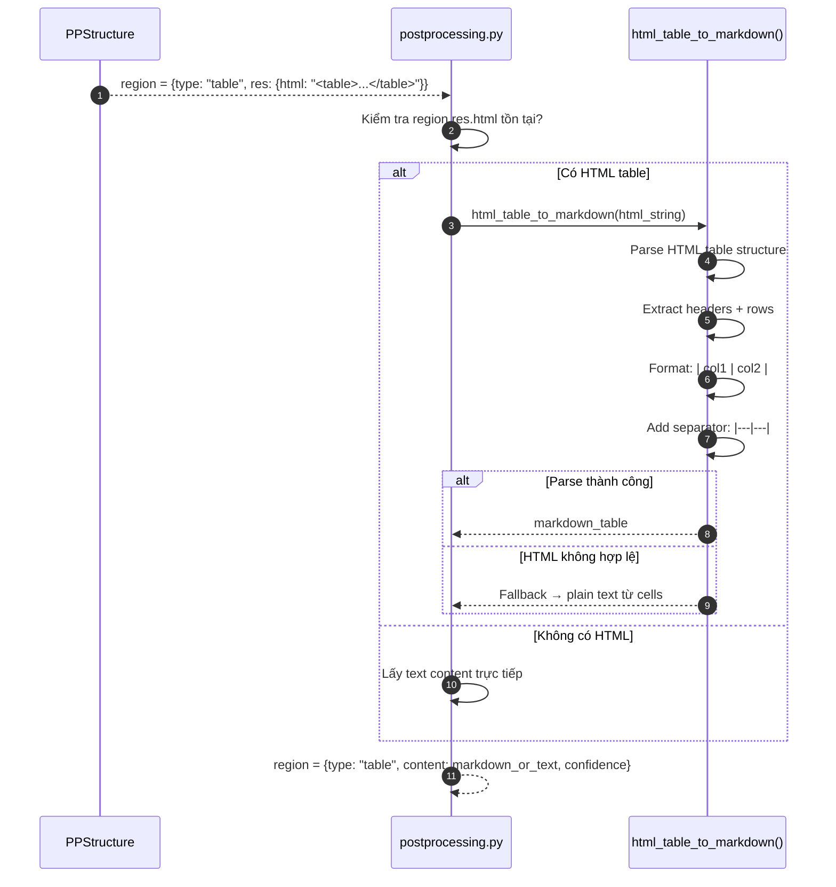

# Sequence Diagram — PaddleVL Worker (StructuredExtractHandler)

> Engine: `paddle_vl` | Method: `structured_extract` | GPU: Yes (có CPU fallback)

## Tổng quan

Worker sử dụng PaddlePaddle PPStructure để phân tích layout tài liệu và trích xuất cấu trúc (text, title, table, list, figure). Có **fallback chain 4 cấp** khi engine chính thất bại.

## Sequence Diagram chính



## Fallback Chain (Chi tiết)

Đây là cơ chế quan trọng nhất của `paddle_vl` — khi engine chính cho kết quả kém, tự động thử engine đơn giản hơn.



## Table Processing Detail



## Chi tiết Data Flow

### Input
| Field | Type | Mô tả |
|-------|------|--------|
| `file_bytes` | `bytes` | Ảnh hoặc PDF |
| `output_format` | `str` | `"json"`, `"md"`, hoặc `"txt"` |

### Image Preprocessing Parameters
| Parameter | Giá trị | Mô tả |
|-----------|---------|--------|
| `MIN_SHORT_SIDE` | 1500 | Cạnh ngắn tối thiểu (upscale nếu nhỏ hơn) |
| `MAX_LONG_SIDE` | 4000 | Cạnh dài tối đa (downscale nếu lớn hơn) |
| PDF DPI | 300 | Resolution khi convert PDF sang ảnh |

### Region Types
| Type | Mô tả | Content Format |
|------|--------|---------------|
| `text` | Đoạn văn bản | Plain text |
| `title` | Tiêu đề | Plain text |
| `table` | Bảng | Markdown table hoặc HTML |
| `list` | Danh sách | Text với bullet points |
| `figure` | Hình ảnh/biểu đồ | `[Figure region]` placeholder |

### Output (JSON)
```json
{
  "pages": [
    {
      "page": 1,
      "regions": [
        {
          "type": "title",
          "content": "Tiêu đề tài liệu",
          "confidence": 0.95,
          "bbox": [x1, y1, x2, y2]
        },
        {
          "type": "text",
          "content": "Nội dung đoạn văn...",
          "confidence": 0.92,
          "bbox": [x1, y1, x2, y2]
        },
        {
          "type": "table",
          "content": "| Col1 | Col2 |\n|---|---|\n| val1 | val2 |",
          "confidence": 0.88,
          "bbox": [x1, y1, x2, y2]
        }
      ],
      "full_text": "Tổng hợp text trang 1"
    }
  ],
  "full_text": "Tổng hợp tất cả trang"
}
```

### Output (Markdown)
```markdown
# Tiêu đề tài liệu

Nội dung đoạn văn...

| Col1 | Col2 |
|---|---|
| val1 | val2 |
```

### Output (TXT)
```
Tiêu đề tài liệu
Nội dung đoạn văn...
Col1  Col2
val1  val2
```

## Fallback Chain Summary

| Level | Engine | GPU | Table Support | Khi nào dùng |
|:-----:|--------|:---:|:---:|--------------|
| 1 | PPStructure(table=True) | ✅ | ✅ | Mặc định — đầy đủ nhất |
| 2 | PPStructure(table=False) | ✅ | ❌ | Table engine lỗi |
| 3 | PaddleOCR | ✅ | ❌ | Layout analysis lỗi |
| 4 | PaddleOCR | ❌ | ❌ | GPU lỗi hoàn toàn |

## Error Classification

| Exception | Loại | Hành động |
|-----------|------|-----------|
| `ConnectionError`, `TimeoutError` | Retriable | NAK + retry 5s |
| `DownloadError`, `UploadError` | Retriable | NAK + retry 5s |
| `InvalidImageError` | Permanent | TERM |
| `PDFSyntaxError` | Permanent | TERM |
| Tất cả 4 fallback levels fail | Permanent | TERM |

## So sánh với các engine khác

| Tiêu chí | paddle_vl | paddle_text | tesseract |
|-----------|-----------|-------------|-----------|
| Method | `structured_extract` | `ocr_text_raw` | `ocr_text_raw` |
| Layout Analysis | ✅ | ❌ | ❌ |
| Table Recognition | ✅ (HTML→MD) | ❌ | ❌ |
| Multi-page PDF | ✅ | ❌ | ✅ |
| Fallback Chain | 4 levels | Không | Không |
| Output formats | json, md, txt | json, txt | json, txt |
| GPU required | Có (fallback CPU) | Có | Không |
| Image upscaling | ✅ (1500-4000px) | ❌ | ❌ |
| Phù hợp cho | Tài liệu phức tạp, bảng, form | Text đơn giản | CPU-only, multi-page |
