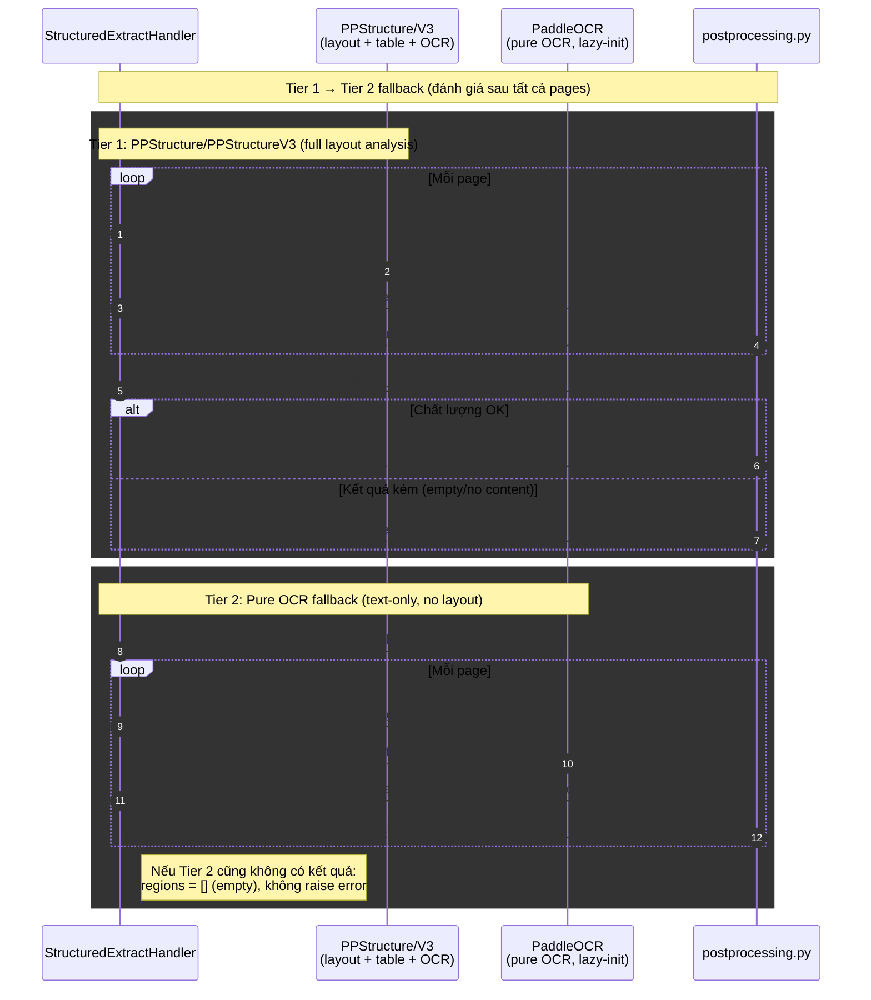
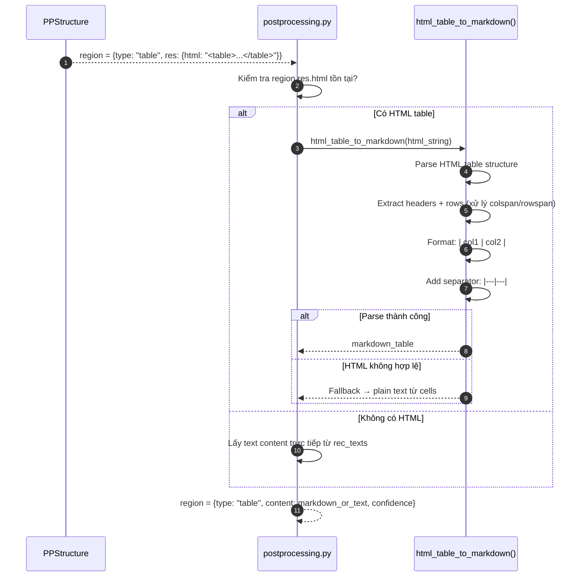

# Sequence Diagram — PaddleVL Worker (StructuredExtractHandler)

> Engine: `paddle_vl` | Method: `structured_extract` | GPU: Yes (có CPU fallback)

## Tổng quan

Worker sử dụng PaddlePaddle PPStructure/PPStructureV3 để phân tích layout tài liệu và trích xuất cấu trúc (text, title, table, list, figure). Có **fallback 2 tier** khi engine chính cho kết quả kém: Tier 1 (PPStructure) → Tier 2 (Pure OCR). Quality assessment chạy sau khi xử lý tất cả pages.

## Sequence Diagram chính

```mermaid
%%{init: {'theme': 'default'}}%%
sequenceDiagram
    autonumber
    participant Main as main.py
    participant Worker as OCRWorker
    participant Queue as QueueClient<br/>(NATS JetStream)
    participant State as WorkerState
    participant Orch as OrchestratorClient<br/>(Backend API)
    participant FP as FileProxyClient<br/>(Backend API)
    participant Proc as OCRProcessor
    participant Handler as StructuredExtractHandler
    participant Pre as preprocessing.py
    participant PPStruct as PPStructure/V3 Engine
    participant Post as postprocessing.py
    participant Debug as DebugContext

    Note over Main,Debug: ===== PHASE 1: WORKER STARTUP =====

    Main->>Worker: OCRWorker(shutdown_handler)
    Worker->>Proc: OCRProcessor()
    Note right of Proc: OCR_ENGINE="paddle_vl"
    Proc->>Handler: StructuredExtractHandler(use_gpu, lang)

    alt PaddleOCR v3.x
        Handler->>PPStruct: PPStructureV3(lang="en")
        Note right of PPStruct: v3: tự quản lý GPU, không có use_gpu param
    else PaddleOCR v2.x
        Handler->>PPStruct: PPStructure(use_gpu=True, lang="en",<br/>layout=True, table=True, ocr=True, show_log=False)
    end
    PPStruct-->>Handler: primary engine ready

    Note right of Handler: Fallback OCR engine: lazy-init<br/>(chỉ khởi tạo khi Tier 1 fail quality check)

    Worker->>Orch: POST /register<br/>{service_type, allowed_methods: ["structured_extract"],<br/>engine_info, supported_output_formats: ["json","md","txt","html"]}
    Orch-->>Worker: {type_status: "APPROVED", access_key}
    Worker->>Queue: connect() → NATS JetStream<br/>stream="OCR_JOBS", subject filter
    Worker->>Worker: heartbeat.start()

    Note over Main,Debug: ===== PHASE 2: NHẬN JOB =====

    Worker->>Queue: pull_job(timeout=5s)
    Queue-->>Worker: job = {job_id, file_id, method: "structured_extract", output_format: "json"}

    Note over Main,Debug: ===== PHASE 3: XỬ LÝ JOB =====

    Worker->>State: start_job(job_id)
    Worker->>Orch: PATCH /jobs/{job_id}/status {status: "PROCESSING"}
    Worker->>FP: POST /file-proxy/download {job_id, file_id}
    FP-->>Worker: file_bytes

    Worker->>Proc: process(file_bytes, "json", "structured_extract")
    Proc->>Handler: process(file_bytes, "json")
    Handler->>Debug: DebugContext() (nếu DEBUG_OCR=true)

    Note over Handler,Debug: --- Preprocessing: Load images ---

    Handler->>Pre: load_images(file_bytes)
    alt File là PDF
        Pre->>Pre: pdf2image.convert_from_bytes(dpi=200)
        Pre-->>Handler: images = [np_array_page1, np_array_page2, ...]
    else File là ảnh
        Pre->>Pre: PIL.Image.open() → RGB → np.array
        Pre-->>Handler: images = [np_array]
    end

    Note over Handler,Debug: --- Tier 1: Structured layout extraction ---

    loop Với mỗi (image, page_idx) trong images
        Handler->>Debug: save_input_image(image, page_idx)
        Handler->>Pre: prepare_image(image)
        Note right of Pre: MIN_SHORT_SIDE = 960<br/>MAX_LONG_SIDE = 1280<br/>Downscale nếu long_side > 1280<br/>Upscale nếu short_side < 960
        Pre-->>Handler: prepared image

        alt PaddleOCR v3.x
            Handler->>PPStruct: self.engine.predict(prepared)
            PPStruct-->>Handler: raw_result (list)
            Handler->>Post: extract_regions_v3(raw_result, page_idx)
        else PaddleOCR v2.x
            Handler->>PPStruct: self.engine(prepared)
            PPStruct-->>Handler: raw_result = [{type, bbox, res, ...}, ...]
            Handler->>Debug: save_raw_engine_output(raw_result, page_idx, "tier1")
            Handler->>Post: extract_regions(raw_result, page_idx)
        end

        Post->>Post: Parse từng region:
        Note right of Post: type="text" → extract text content<br/>type="title" → extract title<br/>type="table" → convert HTML to Markdown<br/>type="list" → extract list items<br/>type="figure" → mark as figure region
        Post-->>Handler: page_result = {page_number, regions: [{type, bbox, content, confidence}]}

        Handler->>Handler: all_pages.append(page_result)

        alt Multi-page document (len > 1)
            Handler->>Handler: paddle.device.cuda.empty_cache()
            Note right of Handler: Free GPU memory giữa các pages
        end
    end

    Note over Handler,Debug: --- Quality Assessment (sau TẤT CẢ pages) ---

    Handler->>Post: assess_result_quality(all_pages)
    Post->>Post: Kiểm tra: có regions không? có content không?

    alt Chất lượng ĐẠT
        Post-->>Handler: quality_ok = True
        Note right of Handler: Dùng kết quả Tier 1
    else Chất lượng KHÔNG ĐẠT → Tier 2 Fallback
        Post-->>Handler: quality_ok = False

        Note over Handler,Debug: --- Tier 2: Pure OCR fallback ---

        Handler->>Handler: all_pages = [] (reset)
        Handler->>Handler: _get_ocr_engine() → lazy init PaddleOCR

        loop Với mỗi (image, page_idx) trong images
            Handler->>Pre: prepare_image(image)
            Pre-->>Handler: prepared

            alt PaddleOCR v3.x
                Handler->>Handler: ocr.predict(prepared)
                Handler->>Post: extract_regions_v3_ocr_fallback(raw_ocr, page_idx)
            else PaddleOCR v2.x
                Handler->>Handler: ocr.ocr(prepared, cls=True)
                alt OCR result is empty
                    Handler->>Handler: page_result = {page_number, regions: []}
                else Có kết quả
                    Handler->>Post: extract_regions_from_raw_ocr(raw_ocr, page_idx)
                end
            end
            Post-->>Handler: page_result
            Handler->>Handler: all_pages.append(page_result)
        end
    end

    Note over Handler,Debug: --- Postprocessing: Format output ---

    Handler->>Debug: save_pipeline_summary()
    Handler->>Post: format_structured_output(all_pages, "json")
    alt output_format == "json"
        Post->>Post: JSON đầy đủ với pages, regions, summary
        Post-->>Handler: json_bytes
    else output_format == "md"
        Post->>Post: Markdown: # titles, paragraphs, | tables |, page breaks
        Post-->>Handler: md_bytes
    else output_format == "html"
        Post->>Post: Full HTML document với embedded CSS
        Post-->>Handler: html_bytes
    else output_format == "txt"
        Post->>Post: Plain text, tables as markdown, figures as [Figure]
        Post-->>Handler: text_bytes
    end

    Handler-->>Proc: result_bytes
    Proc-->>Worker: result_bytes

    Worker->>Worker: Determine content_type:<br/>json→"application/json", md→"text/markdown",<br/>html→"text/html", txt→"text/plain"
    Worker->>FP: POST /file-proxy/upload {job_id, file_id, base64(result), content_type}
    FP-->>Worker: {result_key}
    Worker->>Orch: PATCH /jobs/{job_id}/status {status: "COMPLETED", engine_version}
    Worker->>Queue: ack(msg_id)

    Note over Worker,State: Cleanup (finally block)
    Worker->>State: end_job()
    State-->>Worker: current_job_id=None, status="idle", files_completed++
```



## Fallback Chain (2 Tiers)



## Table Processing Detail



## Chi tiết Data Flow

### Input
| Field | Type | Mô tả |
|-------|------|--------|
| `file_bytes` | `bytes` | Ảnh hoặc PDF |
| `output_format` | `str` | `"json"`, `"md"`, `"html"`, hoặc `"txt"` |

### Image Preprocessing Parameters
| Parameter | Giá trị | Mô tả |
|-----------|---------|--------|
| `MIN_SHORT_SIDE` | 960 | Cạnh ngắn tối thiểu (upscale nếu nhỏ hơn) |
| `MAX_LONG_SIDE` | 1280 | Cạnh dài tối đa (downscale nếu lớn hơn) |
| PDF DPI | 200 | Resolution khi convert PDF sang ảnh (pdf2image) |

### Region Types
| Type | Mô tả | Content Format |
|------|--------|---------------|
| `text` | Đoạn văn bản | Plain text |
| `title` | Tiêu đề | Plain text |
| `table` | Bảng | Markdown table hoặc HTML |
| `list` | Danh sách | Text với bullet points |
| `figure` | Hình ảnh/biểu đồ | `[Figure region]` placeholder |

### Output (JSON)
```json
{
  "pages": [
    {
      "page_number": 1,
      "regions": [
        {
          "type": "title",
          "content": "Tiêu đề tài liệu",
          "confidence": 0.95,
          "bbox": [x1, y1, x2, y2]
        },
        {
          "type": "text",
          "content": "Nội dung đoạn văn...",
          "confidence": 0.92,
          "bbox": [x1, y1, x2, y2]
        },
        {
          "type": "table",
          "html": "<table>...</table>",
          "markdown": "| Col1 | Col2 |\n|---|---|\n| val1 | val2 |",
          "bbox": [x1, y1, x2, y2]
        }
      ]
    }
  ],
  "summary": {
    "total_pages": 1,
    "total_regions": 12,
    "tables_found": 2,
    "text_blocks": 8
  }
}
```

### Output (Markdown)
```markdown
# Tiêu đề tài liệu

Nội dung đoạn văn...

| Col1 | Col2 |
|---|---|
| val1 | val2 |

---
```

### Output (HTML)
```html
<!DOCTYPE html>
<html>
<head><title>OCR Result</title><style>/* embedded CSS */</style></head>
<body>
  <h1>Tiêu đề</h1>
  <table>...</table>
  <p>Nội dung</p>
  <div class="page-break">Page 2</div>
</body>
</html>
```

### Output (TXT)
```
Tiêu đề tài liệu
Nội dung đoạn văn...
| Col1 | Col2 |
|---|---|
| val1 | val2 |
```

## Fallback Summary

| Tier | Engine | Khi nào dùng |
|:----:|--------|--------------|
| 1 | PPStructure/PPStructureV3 (layout + table + OCR) | Mặc định — đầy đủ nhất |
| 2 | PaddleOCR (pure OCR, lazy-init) | Tier 1 quality assessment fail |

> **Note:** Trước đây có 4-level fallback (PPStructure table → no-table → OCR GPU → OCR CPU).
> Code hiện tại đã đơn giản hóa thành 2 tiers. Quality assessment chạy sau tất cả pages (không per-page).

## Error Classification

| Exception | Loại | Hành động |
|-----------|------|-----------|
| `ConnectionError`, `TimeoutError` | Retriable | NAK + retry 5s |
| `DownloadError`, `UploadError` | Retriable | NAK + retry 5s |
| `InvalidImageError` | Permanent | TERM |
| `PDFSyntaxError` | Permanent | TERM |
| Unexpected Exception | Retriable | NAK + retry (conservative) |
| 404 Job not found | — | TERM (stale message) |

## So sánh với các engine khác

| Tiêu chí | paddle_vl | paddle_text | tesseract |
|-----------|-----------|-------------|-----------|
| Method | `structured_extract` | `ocr_paddle_text` | `ocr_tesseract_text` |
| Layout Analysis | ✅ | ❌ | ❌ |
| Table Recognition | ✅ (HTML→MD) | ❌ | ❌ |
| Multi-page PDF | ✅ | ✅ | ✅ |
| Fallback Chain | 2 tiers | Không | Không |
| Output formats | json, md, html, txt | json, txt | json, txt |
| GPU required | Có (fallback trong pure OCR) | Có | Không |
| Image preprocessing | Upscale/downscale (960-1280px) | Không | Không |
| Phù hợp cho | Tài liệu phức tạp, bảng, form | Text đơn giản | CPU-only, multi-page |
