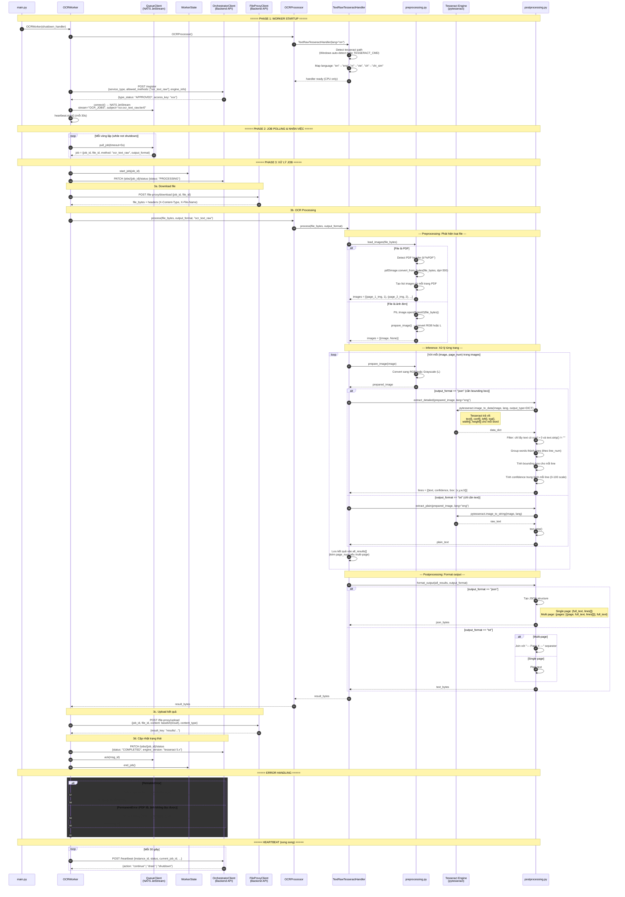
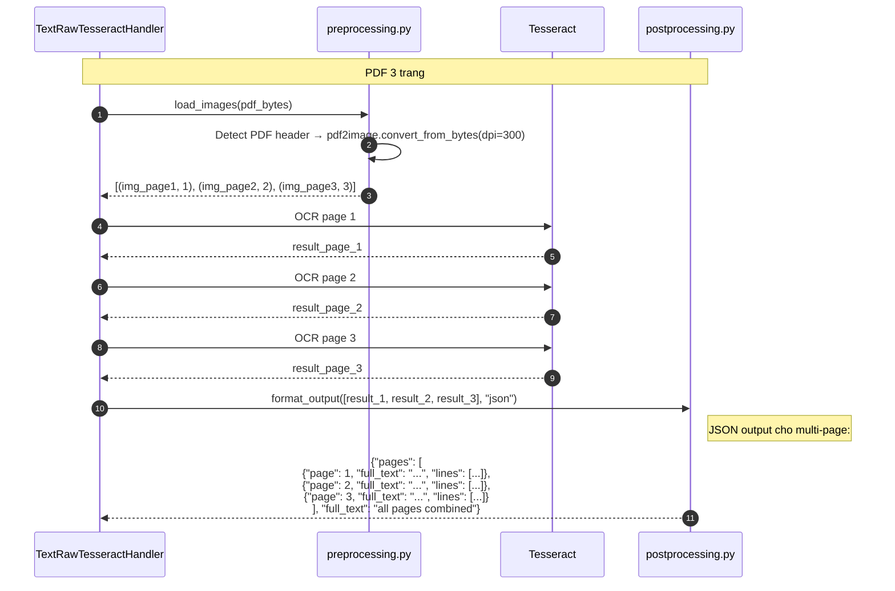

# Sequence Diagram — Tesseract Worker (TextRawTesseractHandler)

> Engine: `tesseract` | Method: `ocr_text_raw` | GPU: No (CPU only)

## Tổng quan

Worker sử dụng Tesseract OCR (pytesseract) để trích xuất text. Hỗ trợ cả ảnh đơn và PDF nhiều trang. Chạy hoàn toàn trên CPU.

## Sequence Diagram



## Chi tiết: Xử lý Multi-page PDF



## Chi tiết Data Flow

### Input
| Field | Type | Mô tả |
|-------|------|--------|
| `file_bytes` | `bytes` | Ảnh (PNG, JPG, TIFF) hoặc PDF |
| `output_format` | `str` | `"json"` hoặc `"txt"` |

### Language Mapping
| Input | Tesseract Code |
|-------|---------------|
| `en` | `eng` |
| `vi` | `vie` |
| `ch` | `chi_sim` |
| `ja` | `jpn` |
| `ko` | `kor` |

### Output (JSON - Single Page)
```json
{
  "full_text": "Toàn bộ text",
  "lines": [
    {
      "text": "Dòng text",
      "confidence": 85.5,
      "box": [x, y, width, height]
    }
  ]
}
```

### Output (JSON - Multi Page)
```json
{
  "pages": [
    {
      "page": 1,
      "full_text": "Text trang 1",
      "lines": [{"text": "...", "confidence": 90.2, "box": [x,y,w,h]}]
    },
    {
      "page": 2,
      "full_text": "Text trang 2",
      "lines": [...]
    }
  ],
  "full_text": "Tổng hợp tất cả trang"
}
```

### Output (TXT - Multi Page)
```
--- Page 1 ---
Nội dung trang 1

--- Page 2 ---
Nội dung trang 2
```

## Error Classification

| Exception | Loại | Hành động |
|-----------|------|-----------|
| `ConnectionError`, `TimeoutError` | Retriable | NAK + retry 5s |
| `DownloadError`, `UploadError` | Retriable | NAK + retry 5s |
| `PDFSyntaxError` | Permanent | TERM |
| `UnidentifiedImageError` | Permanent | TERM |
| `TesseractNotFoundError` | Permanent | TERM |

## So sánh với PaddleText

| Tiêu chí | Tesseract | PaddleText |
|-----------|-----------|------------|
| GPU | Không | Có |
| Multi-page PDF | Có | Không |
| Confidence scale | 0-100 | 0.0-1.0 |
| Box format | `[x, y, w, h]` | `[[x1,y1],[x2,y2],[x3,y3],[x4,y4]]` |
| Tốc độ | Chậm hơn | Nhanh hơn (GPU) |
