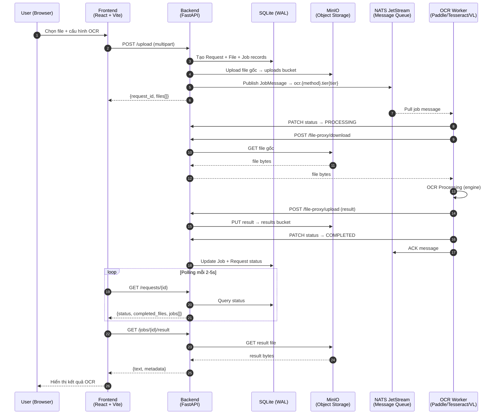
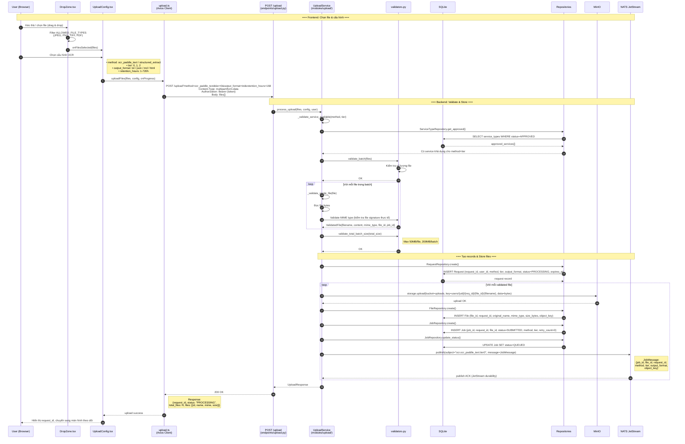
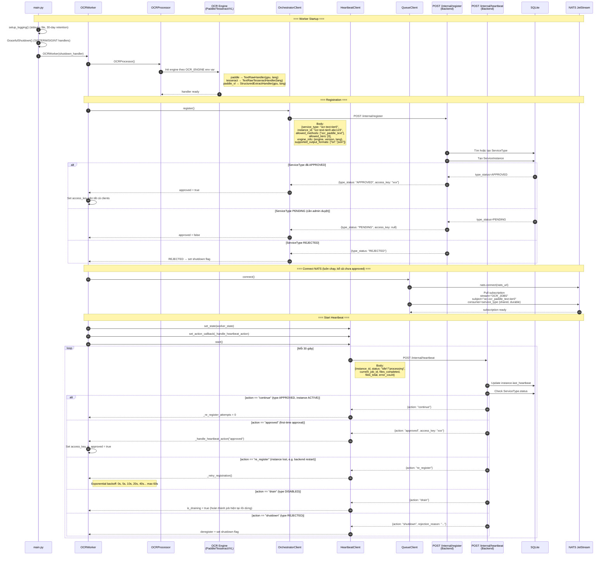
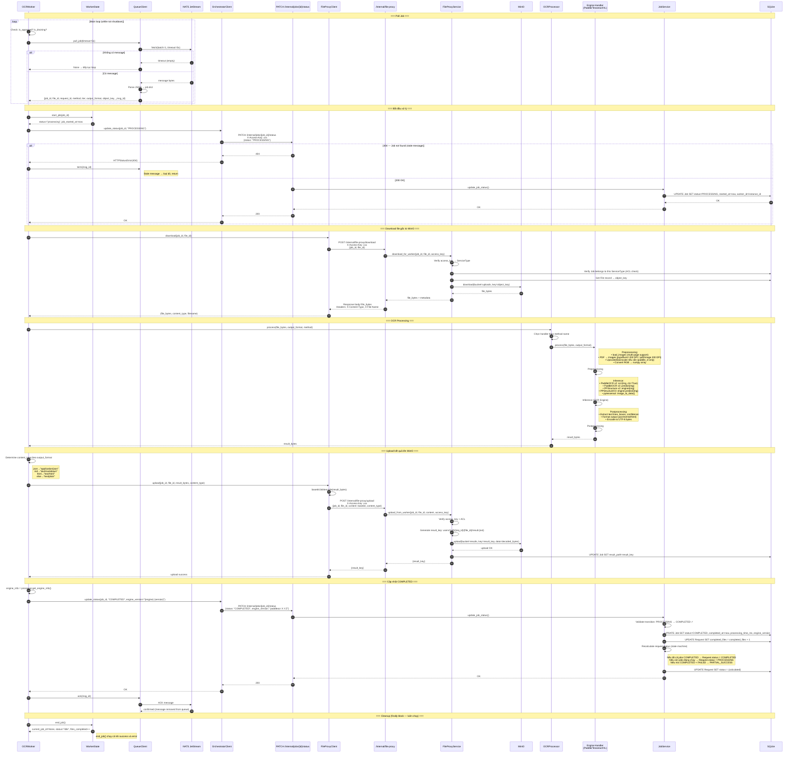
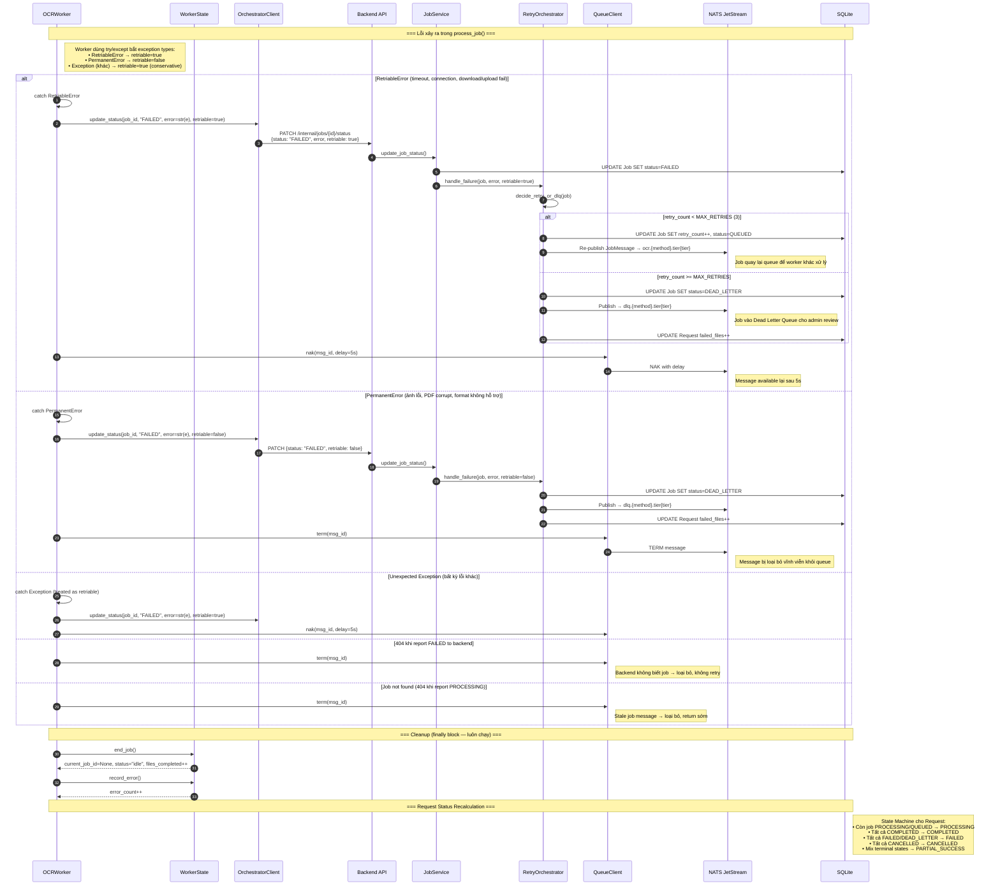
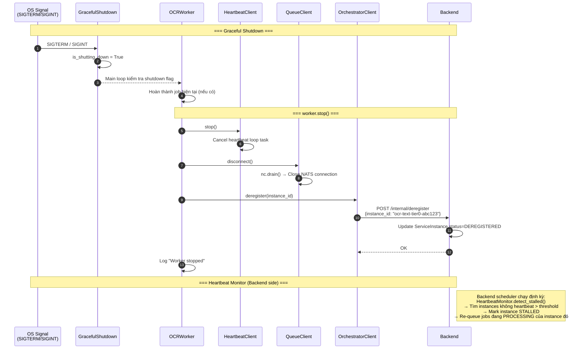

# Full Flow Sequence Diagram — User Upload → Worker Output → Result Display

> Luồng xử lý end-to-end toàn bộ hệ thống OCR/IDP Platform

---

## 1. Diagram tổng quan (High-Level)



---

## 2. Phase 1 — User Upload (Chi tiết)



---

## 3. Phase 2 — Worker Registration & Approval



---

## 4. Phase 3 — Job Processing (Chi tiết nhất)



---

## 5. Phase 3b — Error & Retry Flow



---

## 6. Phase 4 — Frontend Polling & Hiển thị kết quả

```mermaid
%%{init: {'theme': 'default'}}%%
sequenceDiagram
    autonumber
    participant User as User (Browser)
    participant JobUI as JobStatus.tsx
    participant ResultUI as ResultViewer.tsx
    participant JobAPI as jobs.ts / requests.ts
    participant ReqEP as GET /requests/{id}<br/>(endpoints/requests.py)
    participant JobEP as GET /jobs/{id}/result<br/>(endpoints/jobs.py)
    participant DB as SQLite
    participant MinIO as MinIO

    Note over User,MinIO: === Polling trạng thái ===

    loop Polling mỗi 2-5s (while status == PROCESSING)
        JobUI->>JobAPI: getRequestStatus(request_id)
        JobAPI->>ReqEP: GET /requests/{request_id}<br/>Authorization: Bearer {token}
        ReqEP->>DB: SELECT Request + Jobs WHERE request_id AND user_id
        DB-->>ReqEP: request + jobs[]
        ReqEP-->>JobAPI: RequestDetailResponse

        Note right of JobAPI: Response:<br/>{id, status: "PROCESSING",<br/>total_files: 2, completed_files: 1,<br/>failed_files: 0,<br/>jobs: [{id, file_id, status, processing_time_ms}]}

        JobAPI-->>JobUI: status update
        JobUI-->>User: Cập nhật UI:<br/>progress bar, per-file status
    end

    Note over User,MinIO: === Request hoàn thành ===

    JobAPI-->>JobUI: status = "COMPLETED" (hoặc PARTIAL_SUCCESS)
    JobUI-->>User: Hiển thị nút xem kết quả

    Note over User,MinIO: === Lấy kết quả OCR ===

    User->>ResultUI: Click xem kết quả job

    ResultUI->>JobAPI: getJobResult(job_id)
    JobAPI->>JobEP: GET /jobs/{job_id}/result?format=text<br/>Authorization: Bearer {token}
    JobEP->>DB: Verify job ownership (user_id qua request)
    JobEP->>DB: Get Job → result_path
    JobEP->>MinIO: download(bucket=results, key=result_path)
    MinIO-->>JobEP: result_bytes
    JobEP->>JobEP: Parse result content
    JobEP-->>JobAPI: ResultResponse

    Note right of JobAPI: Response:<br/>{text: "Extracted text...",<br/>lines: 45,<br/>metadata: {method, tier,<br/>processing_time_ms, engine_name}}

    JobAPI-->>ResultUI: result data
    ResultUI-->>User: Hiển thị:<br/>• Extracted text<br/>• Line count<br/>• Processing metadata

    Note over User,MinIO: === Download file kết quả (tùy chọn) ===

    User->>ResultUI: Click download
    ResultUI->>JobAPI: downloadResult(job_id)
    JobAPI->>JobEP: GET /jobs/{job_id}/download
    JobEP->>MinIO: download(bucket=results, key=result_path)
    MinIO-->>JobEP: result_bytes
    JobEP-->>JobAPI: Binary response<br/>Content-Disposition: attachment; filename="document_result.txt"
    JobAPI-->>ResultUI: file blob
    ResultUI-->>User: Browser download dialog

    Note over User,MinIO: === Presigned URL (tùy chọn) ===

    ResultUI->>JobAPI: getPresignedUrl(file_id, "result")
    JobAPI->>JobEP: GET /files/{file_id}/result-url
    JobEP->>MinIO: presigned_get_url(bucket, key, expires=3600)
    MinIO-->>JobEP: https://minio:9000/results/...?token=xxx
    JobEP-->>JobAPI: {url, expires_at}
    JobAPI-->>ResultUI: presigned URL (valid 1h)
```

---

## 7. Graceful Shutdown & Heartbeat Monitor



---

## 8. Tổng hợp Data Flow

### Protocols & Connections

| Kết nối | Protocol | Mô tả |
|---------|----------|--------|
| User ↔ Frontend | HTTPS | Browser SPA |
| Frontend ↔ Backend | HTTP REST | Axios client, Bearer token auth |
| Backend ↔ SQLite | File I/O | WAL mode, async via aiosqlite |
| Backend ↔ MinIO | S3 API | Upload/download objects |
| Backend ↔ NATS | TCP | JetStream publish |
| Worker ↔ NATS | TCP | JetStream pull consumer |
| Worker ↔ Backend | HTTP REST | Internal API, X-Access-Key auth |

### MinIO Buckets

| Bucket | Nội dung | Path Pattern |
|--------|----------|-------------|
| `uploads` | File gốc (ảnh, PDF) | `users/{uid}/{req_id}/{file_id}/{filename}` |
| `results` | Kết quả OCR | `users/{uid}/{req_id}/{file_id}/result.{ext}` |
| `deleted` | File đã xóa (retention cleanup) | moved từ uploads/results |

### NATS Subjects & Streams

| Stream | Subject Pattern | Mục đích |
|--------|----------------|----------|
| `OCR_JOBS` | `ocr.{method}.tier{tier}` | Job queue chính |
| `OCR_DLQ` | `dlq.{method}.tier{tier}` | Dead Letter Queue |

### Database State Machine

```
Job States:
  SUBMITTED → QUEUED → PROCESSING → COMPLETED
                ↑          ↓
                ← ← ←  FAILED (retry)
                           ↓
                      DEAD_LETTER

Request States:
  PROCESSING → COMPLETED | FAILED | PARTIAL_SUCCESS | CANCELLED
```

### Error Classification (Worker)

| Exception | Loại | Worker Action | Backend Action |
|-----------|------|---------------|----------------|
| `RetriableError` | Retriable | NAK (delay 5s) | retry_count++ → re-queue |
| `ConnectionError` | Retriable | NAK (delay 5s) | retry_count++ → re-queue |
| `TimeoutError` | Retriable | NAK (delay 5s) | retry_count++ → re-queue |
| `DownloadError` | Retriable | NAK (delay 5s) | retry_count++ → re-queue |
| `UploadError` | Retriable | NAK (delay 5s) | retry_count++ → re-queue |
| `PermanentError` | Permanent | TERM | → DEAD_LETTER |
| `InvalidImageError` | Permanent | TERM | → DEAD_LETTER |
| `PDFSyntaxError` | Permanent | TERM | → DEAD_LETTER |
| `ValueError` | Permanent | TERM | → DEAD_LETTER |
| Unexpected Exception | Retriable | NAK (delay 5s) | retry_count++ → re-queue |
| Max retries exceeded | — | — | → DEAD_LETTER |
| 404 Job not found | — | TERM | — |

### Security & Access Control

| Layer | Mechanism | Mô tả |
|-------|-----------|--------|
| Frontend → Backend | Bearer Token | Session-based auth (self-host) |
| Worker → Backend | X-Access-Key | Cấp khi ServiceType APPROVED |
| File Access | ACL Check | Job phải thuộc ServiceType của worker |
| User Ownership | Request Check | Request phải thuộc user đang đăng nhập |
