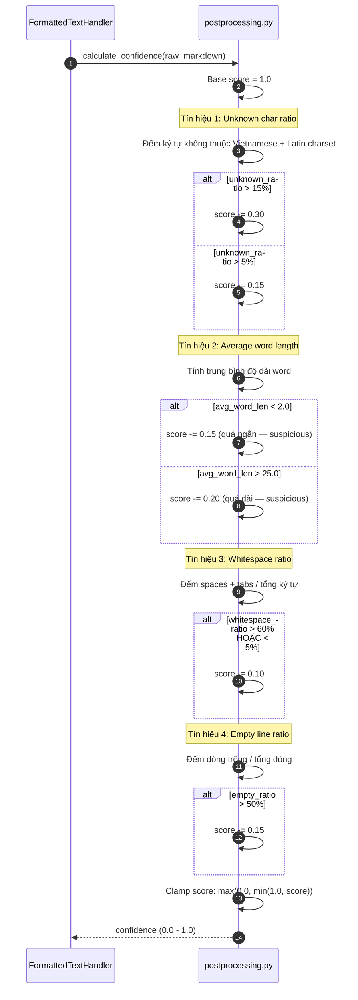
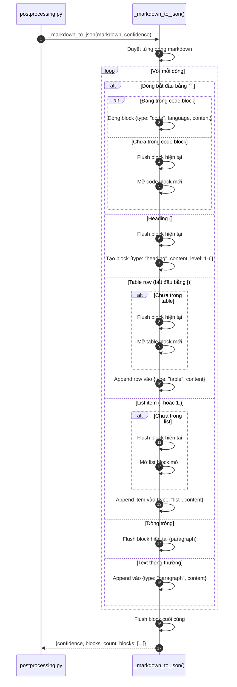
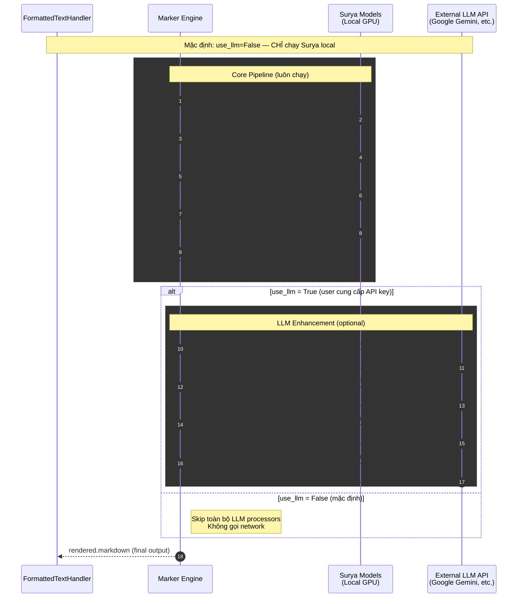

# Sequence Diagram — Marker Worker (FormattedTextHandler)

> Engine: `marker` | Method: `ocr_marker` | GPU: Yes (VRAM peak ~5 GB, batch=8)

## Tổng quan

Worker sử dụng Marker (dựa trên Surya OCR) để trích xuất text giữ nguyên cấu trúc document (heading, table, list, reading order). Pipeline nội bộ của Marker: **detect → layout → recognize → table → assemble**. Hỗ trợ PDF native (không cần render image) và ảnh (PNG, JPG, TIFF). Có chế độ LLM enhancement tùy chọn (mặc định tắt).

## Sequence Diagram chính

```mermaid
%%{init: {'theme': 'default'}}%%
sequenceDiagram
    autonumber
    participant Main as main.py
    participant Worker as OCRWorker
    participant Queue as QueueClient<br/>(NATS JetStream)
    participant State as WorkerState
    participant Orch as OrchestratorClient<br/>(Backend API)
    participant FP as FileProxyClient<br/>(Backend API)
    participant Proc as OCRProcessor
    participant Handler as FormattedTextHandler
    participant Pre as preprocessing.py
    participant Marker as Marker Engine<br/>(Surya OCR)
    participant Post as postprocessing.py

    Note over Main,Post: ===== PHASE 1: WORKER STARTUP =====

    Main->>Worker: OCRWorker(shutdown_handler)
    Worker->>Proc: OCRProcessor()
    Note right of Proc: OCR_ENGINE="marker"
    Proc->>Handler: FormattedTextHandler(use_gpu, lang)

    Handler->>Handler: set_gpu_memory_fraction()
    Handler->>Handler: check_gpu_available(min_free_mb=2000)
    Handler->>Handler: _parse_languages(lang)
    Note right of Handler: "en" → ["en"]<br/>"vi" → ["vi", "en"]<br/>"en,vi" → ["en", "vi"]

    Handler->>Handler: Kiểm tra LLM mode (env: MARKER_USE_LLM)
    alt MARKER_USE_LLM=true VÀ có GOOGLE_API_KEY
        Handler->>Handler: use_llm = True
    else Mặc định hoặc thiếu API key
        Handler->>Handler: use_llm = False (chỉ Surya local models)
    end

    Handler->>Marker: create_model_dict()
    Note right of Marker: Load 4 models (1 lần, ~15-30s, giữ resident):<br/>• surya_det — Text detection (~200MB)<br/>• surya_rec — Text recognition (~500MB)<br/>• surya_layout — Layout analysis (~200MB)<br/>• surya_tablerec — Table recognition (~200MB)
    Marker-->>Handler: model_dict (all models loaded)
    Handler->>Handler: log_gpu_memory("after Marker models loaded")

    Worker->>Orch: POST /register<br/>{service_type: "ocr-marker", instance_id,<br/>allowed_methods: ["ocr_marker"],<br/>supported_output_formats: ["md","html","json"],<br/>engine_info}
    Orch-->>Worker: {type_status: "APPROVED", access_key}
    Worker->>Queue: connect() → NATS JetStream<br/>stream="OCR_JOBS", subject="ocr.ocr_marker.tier0"
    Worker->>Worker: heartbeat.start() (mỗi 30s)

    Note over Main,Post: ===== PHASE 2: JOB POLLING LOOP =====

    loop Mỗi vòng lặp (while not shutdown)
        Worker->>Worker: Check: is_approved? is_draining?
        Worker->>Queue: pull_job(timeout=5s)
        Queue-->>Worker: job = None (nếu không có việc)
        Note right of Worker: Tiếp tục polling...

        Queue-->>Worker: job = {job_id, file_id, method: "ocr_marker", output_format: "md"}
    end

    Note over Main,Post: ===== PHASE 3: XỬ LÝ JOB =====

    Worker->>State: start_job(job_id)
    State-->>Worker: status = "processing"

    Worker->>Orch: PATCH /jobs/{job_id}/status<br/>{status: "PROCESSING"}
    alt 404 — Job not found
        Orch-->>Worker: 404
        Worker->>Queue: term(msg_id)
        Note right of Queue: Stale message → loại bỏ
    else 200 OK
        Orch-->>Worker: 200 OK
    end

    Note over Worker,FP: 3a. Download file từ MinIO qua Backend

    Worker->>FP: POST /file-proxy/download<br/>{job_id, file_id}
    FP-->>Worker: file_bytes (PDF hoặc image)

    Note over Worker,Post: 3b. OCR Processing

    Worker->>Proc: process(file_bytes, "md", "ocr_marker")
    Proc->>Handler: process(file_bytes, "md")

    Note over Handler,Post: --- Preprocessing: Save to temp file ---

    Handler->>Pre: load_document(file_bytes)
    alt File là PDF (magic bytes %PDF)
        Pre->>Pre: Lưu temp file với suffix .pdf
    else File là ảnh
        Pre->>Pre: Detect format qua PIL (PNG/JPG/TIFF)
        Pre->>Pre: Lưu temp file với suffix tương ứng
    end
    Pre-->>Handler: temp_file_path

    Note over Handler,Post: --- Inference: Marker Pipeline ---

    Handler->>Marker: PdfConverter(artifact_dict=model_dict, use_llm=False)
    Handler->>Marker: converter(temp_file_path)

    Note right of Marker: Marker internal pipeline (5 bước):<br/>1. DETECT — Surya text detection<br/>2. LAYOUT — Phân tích cấu trúc trang<br/>(heading, paragraph, table, list, figure)<br/>3. RECOGNIZE — Nhận dạng text từng vùng<br/>4. TABLE — Nhận dạng cấu trúc bảng<br/>5. ASSEMBLE — Ghép thành Markdown<br/>giữ đúng reading order

    alt use_llm = True
        Note right of Marker: Chạy thêm LLM processors:<br/>• LLMTable — sửa bảng phức tạp<br/>• LLMEquation — chuyển equation → LaTeX<br/>• LLMHandwriting — nhận dạng chữ viết tay<br/>• LLMPageCorrection — sửa lỗi OCR theo ngữ nghĩa<br/>(gọi external API: Google Gemini hoặc tương thích)
    else use_llm = False (mặc định)
        Note right of Marker: Bỏ qua tất cả LLM processors<br/>Không gọi network, không cần API key
    end

    Marker-->>Handler: rendered = {markdown: "raw markdown output"}

    Note over Handler,Post: --- Postprocessing: Confidence + Format ---

    Handler->>Post: calculate_confidence(raw_markdown)
    Post->>Post: Heuristic scoring 4 tín hiệu (chi tiết bên dưới)
    Post-->>Handler: confidence (0.0 - 1.0)

    Handler->>Handler: cleanup_gpu_memory()

    Handler->>Post: format_output(raw_markdown, confidence, "md")
    Post->>Post: _normalize_markdown(raw_markdown)
    Note right of Post: • Remove standalone page numbers<br/>• Trim whitespace thừa

    alt output_format == "md"
        Post-->>Handler: markdown_bytes (UTF-8)
    else output_format == "html"
        Post->>Post: markdown → HTML (thư viện markdown)<br/>Wrap trong HTML template với embedded CSS
        Post-->>Handler: html_bytes (UTF-8)
    else output_format == "json"
        Post->>Post: Parse markdown thành structured blocks<br/>(chi tiết trong diagram riêng bên dưới)
        Post-->>Handler: json_bytes (UTF-8)
    end

    Handler-->>Proc: result_bytes
    Proc-->>Worker: result_bytes

    Note over Worker,FP: 3c. Upload kết quả lên MinIO qua Backend

    Worker->>Worker: Determine content_type:<br/>md→"text/markdown", html→"text/html", json→"application/json"
    Worker->>FP: POST /file-proxy/upload<br/>{job_id, file_id, content: base64(result), content_type}
    FP-->>Worker: {result_key: "results/..."}

    Note over Worker,Orch: 3d. Cập nhật trạng thái hoàn thành

    Worker->>Orch: PATCH /jobs/{job_id}/status<br/>{status: "COMPLETED", engine_version: "marker-pdf X.Y.Z"}
    Orch-->>Worker: 200 OK

    Worker->>Queue: ack(msg_id)
    Queue-->>Worker: ACK confirmed

    Note over Worker,State: 3e. Cleanup state (finally block — luôn chạy)
    Worker->>State: end_job()
    State-->>Worker: current_job_id=None, status="idle", files_completed++

    Note over Main,Post: ===== ERROR HANDLING =====

    rect
        Note over Worker,Post: Nếu xảy ra lỗi trong quá trình xử lý:

        alt RetriableError (download/upload timeout, connection error)
            Worker->>Orch: PATCH /jobs/{job_id}/status<br/>{status: "FAILED", error, retriable: true}
            Worker->>Queue: nak(msg_id, delay=5s)
            Note right of Queue: Message sẽ được retry sau 5s
        else PermanentError (file không hợp lệ, format lỗi)
            Worker->>Orch: PATCH /jobs/{job_id}/status<br/>{status: "FAILED", error, retriable: false}
            Worker->>Queue: term(msg_id)
            Note right of Queue: Message bị loại bỏ vĩnh viễn
        else Unexpected Exception (bất kỳ lỗi khác)
            Note right of Worker: Xử lý như retriable (conservative)
            Worker->>Orch: PATCH /jobs/{job_id}/status<br/>{status: "FAILED", error, retriable: true}
            Worker->>Queue: nak(msg_id, delay=5s)
        else 404 khi report FAILED
            Worker->>Queue: term(msg_id)
            Note right of Queue: Backend không biết job → loại bỏ
        end

        Worker->>State: record_error()
        State-->>Worker: error_count++
    end

    Note over Main,Post: ===== HEARTBEAT (song song, mỗi 30s) =====

    loop Mỗi 30 giây
        Worker->>Orch: POST /heartbeat<br/>{instance_id, status, current_job_id, files_completed, error_count}
        Orch-->>Worker: {action: "continue"}
        alt action == "continue"
            Worker->>Worker: Reset _re_register_attempts = 0
        else action == "approved"
            Worker->>Worker: Set access_key, is_approved = true
        else action == "re_register"
            Worker->>Worker: _retry_registration() với exponential backoff
            Note right of Worker: Delay: 0s, 5s, 10s, 20s, 40s... max 60s
        else action == "drain"
            Worker->>Worker: is_draining = True → hoàn thành job hiện tại rồi dừng
        else action == "shutdown"
            Worker->>Orch: POST /deregister {instance_id}
            Worker->>Worker: shutdown
        end
    end
```



## Confidence Scoring (Heuristic)



## JSON Output Parsing (Markdown → Structured Blocks)



## LLM Enhancement Mode (Optional)



## Chi tiết Data Flow

### Input
| Field | Type | Mô tả |
|-------|------|--------|
| `file_bytes` | `bytes` | PDF (native support) hoặc ảnh (PNG, JPG, TIFF) |
| `output_format` | `str` | `"md"`, `"html"`, hoặc `"json"` |

### VRAM Budget
| Batch Size | VRAM Average | VRAM Peak | Kết quả |
|:----------:|:------------:|:---------:|:-------:|
| 32 (default) | ~6 GB | ~7 GB | OOM trên 8GB card |
| 8 (recommended) | ~3.5 GB | ~5 GB | OK cho RTX 3070 8GB |
| 4 (safe) | ~2 GB | ~3 GB | Fallback nếu OOM |

### Environment Variables (PHẢI set trước khi import marker)
| Variable | Default | Mô tả |
|----------|---------|--------|
| `DETECTOR_BATCH_SIZE` | 32 → **set 8** | Batch size cho text detection |
| `RECOGNITION_BATCH_SIZE` | 32 → **set 8** | Batch size cho text recognition |
| `LAYOUT_BATCH_SIZE` | 32 → **set 8** | Batch size cho layout analysis |
| `INFERENCE_RAM` | auto → **set 8** | RAM hint (GB) |
| `TORCH_DEVICE` | auto → **set cuda** | Device cho inference |
| `MARKER_USE_LLM` | `false` | Bật LLM enhancement (cần API key) |
| `GOOGLE_API_KEY` | — | API key cho LLM mode (user tự cung cấp) |

### Language Parsing
| Input `lang` | Output `languages` | Ghi chú |
|:------------:|:------------------:|---------|
| `"en"` | `["en"]` | English only |
| `"vi"` | `["vi", "en"]` | Vietnamese + English (luôn kèm) |
| `"en,vi"` | `["en", "vi"]` | Multi-language |

### Output (Markdown)
```markdown
# Tiêu đề tài liệu

Nội dung đoạn văn giữ nguyên reading order...

| Col1 | Col2 |
|------|------|
| val1 | val2 |

- List item 1
- List item 2
```

### Output (HTML)
```html
<!DOCTYPE html>
<html lang="vi">
<head><meta charset="utf-8"><style>/* embedded CSS */</style></head>
<body>
  <h1>Tiêu đề</h1>
  <p>Nội dung</p>
  <table>...</table>
</body>
</html>
```

### Output (JSON)
```json
{
  "confidence": 0.85,
  "blocks_count": 5,
  "blocks": [
    {"type": "heading", "content": "Tiêu đề", "level": 1},
    {"type": "paragraph", "content": "Nội dung đoạn văn..."},
    {"type": "table", "content": "| Col1 | Col2 |\n|---|\n| val1 | val2 |"},
    {"type": "list", "content": "- Item 1\n- Item 2"},
    {"type": "code", "content": "print('hello')", "language": "python"}
  ]
}
```

## Normalize Markdown

| Bước | Mô tả |
|------|--------|
| Remove page numbers | Loại bỏ dòng standalone kiểu `- 5 -`, `Page 5` |
| Trim whitespace | Dọn khoảng trắng thừa |

> **P2 refinement (chưa implement):** normalize heading levels (h1→h4 jump), merge paragraphs bị ngắt thừa từ PDF, clean table formatting.

## Error Classification

| Exception | Loại | Hành động |
|-----------|------|-----------|
| `ConnectionError`, `TimeoutError` | Retriable | NAK + retry sau 5s |
| `DownloadError`, `UploadError` | Retriable | NAK + retry sau 5s |
| `InvalidImageError`, `ValueError` | Permanent | TERM + không retry |
| Marker internal error | Permanent | TERM + không retry |
| `torch.cuda.OutOfMemoryError` | **OOM** | Giảm batch → retry 1 lần → Permanent nếu vẫn fail |
| Unexpected Exception | Retriable | NAK + retry (conservative) |
| 404 Job not found | — | TERM (stale message) |

### OOM Recovery Strategy

`torch.cuda.OutOfMemoryError` **không nên retry mù** vì cùng file + cùng batch size sẽ OOM lại → retry loop vô hạn.

Handler tự xử lý OOM trước khi propagate ra worker:

```
Marker inference
    │
    ▼ OOM!
cleanup_gpu_memory()
    │
    ▼
Giảm batch_size: 8 → 4
    │
    ▼
Retry 1 lần với batch=4
    │
    ├─ Thành công → trả kết quả bình thường
    │
    └─ OOM lần 2 → raise PermanentError
                     "OOM even with batch=4 — file quá phức tạp cho 8GB VRAM"
                         │
                         ▼
                    Worker report FAILED (retriable=false)
                    Queue TERM message (không retry nữa)
```

**Trong handler.py:**

```python
try:
    rendered = converter(doc_input)
except torch.cuda.OutOfMemoryError:
    cleanup_gpu_memory()
    logger.warning("CUDA OOM với batch=8 — thử lại với batch=4")

    # Giảm batch size runtime
    os.environ["DETECTOR_BATCH_SIZE"] = "4"
    os.environ["RECOGNITION_BATCH_SIZE"] = "4"
    os.environ["LAYOUT_BATCH_SIZE"] = "4"

    try:
        # Tạo converter mới với batch size đã giảm
        converter = PdfConverter(artifact_dict=self.model_dict, use_llm=self.use_llm)
        rendered = converter(doc_input)

        # Khôi phục batch size cho job tiếp theo
        os.environ["DETECTOR_BATCH_SIZE"] = "8"
        os.environ["RECOGNITION_BATCH_SIZE"] = "8"
        os.environ["LAYOUT_BATCH_SIZE"] = "8"
    except torch.cuda.OutOfMemoryError:
        cleanup_gpu_memory()
        raise PermanentError(
            "CUDA OOM with batch=4 — file too complex for 8GB VRAM"
        )
```

**Lưu ý:** Cần thêm `torch.cuda.OutOfMemoryError` vào `NON_RETRIABLE_ERRORS` trong `app/utils/errors.py` để nếu OOM leak ra ngoài handler, worker không retry vô hạn:

```python
# app/utils/errors.py — thêm vào list
NON_RETRIABLE_ERRORS = [
    "ValueError",
    "UnidentifiedImageError",
    "PDFSyntaxError",
    "InvalidImageError",
    "OutOfMemoryError",  # CUDA OOM — retry cùng config sẽ fail lại
]
```

## So sánh với các engine khác

| Tiêu chí | marker | paddle_vl | paddle_text | tesseract |
|-----------|--------|-----------|-------------|-----------|
| Method | `ocr_marker` | `structured_extract` | `ocr_paddle_text` | `ocr_tesseract_text` |
| Layout Analysis | Surya (detect+layout+table) | PPStructure | Không | Không |
| Giữ reading order | Có | Có | Không | Không |
| Table Recognition | Có (surya_tablerec) | Có (HTML→MD) | Không | Không |
| PDF native support | Có (không cần render image) | Không (pdf2image) | Không (pypdfium2) | Không |
| Multi-page PDF | Có | Có | Có | Có |
| Fallback Chain | Không | 2 tiers | Không | Không |
| Output formats | md, html, json | json, md, html, txt | json, txt | json, txt |
| LLM enhancement | Optional (external API) | Không | Không | Không |
| GPU required | Có | Có | Có | Không |
| VRAM peak (batch=8) | ~5 GB | ~4 GB | ~2 GB | N/A |
| Phù hợp cho | Tài liệu cần giữ format, heading, reading order | Tài liệu phức tạp, bảng, form | Text đơn giản | CPU-only, text đơn giản |
